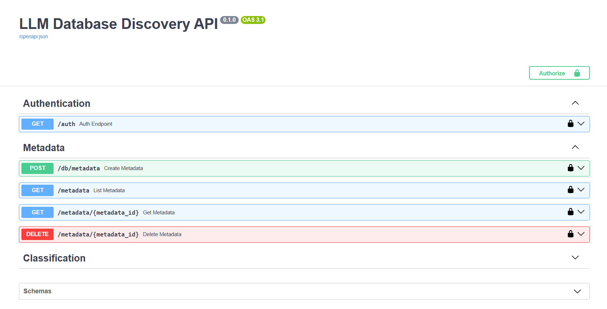
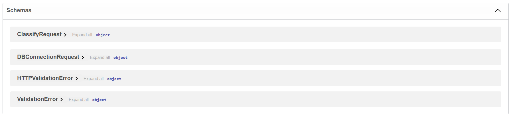

# LLM-Based Database Data Discovery System

This project aims to develop a system for automatic discovery and classification of
data in PostgreSQL databases using LLM (Large Language Model) technologies. The
system developed using the FastAPI framework and containerized with Docker.

## Author Information

**Mehmet KAHRAMAN** \
*R&D Software Engineer* \
29.04.2026

## Project Structure & Features

The system designed with modular approach suitable with MVC design pattern. This separation of concerns ensures high maintainability, testability, and scalability. This project is a containerized REST API built with FastAPI that automatically discovers database schemas, extracts metadata, and classifies Data/PII (Personally Identifiable Information) using LLM service. It analyzes data samples and returns probability distributions for 13 distinct PII categories (e.g., Email, Phone Number, TCKN, Credit Card, etc.).

* **Backend Framework:** FastAPI (Python 3.11)
* **System Database:** PostgreSQL 15
* **ORM & Data Layer:** SQLAlchemy & Psycopg2
* **LLM Provider:** OpenAI Compatible API
* **Containerization:** Docker & Docker Compose
* **Authentication:** HTTP Basic Authentication

The system has 6 different modules (core, routers, services, database, models, schemas) and seperated in the project structure.

```
assets/
src/                           # project src folder
└──── llm_discovery/
    |    ├── core/             # Environment variables and security configurations
    |    |   ├── config.py
    |    |   └── security.py
    |    ├── routers/          # Route Handling and Controllers with FastAPI endpoints
    |    |   ├── auth.py
    |    |   ├── classification.py
    |    |   └── metadata.py
    |    ├── services/         # Service helpers for Database and LLM integrations
    |    |   ├── db_extractor.py
    |    |   └── llm_service.py
    |    ├── __init__.py       # package initialization
    |    ├── database.py       # Database engine and session management
    |    ├── models.py         # SQLAlchemy ORM model definitions
    |    └── schemas.py        # Pydantic request/response validation schemas
    └─ main.py                 # main python script
.dockerignore
.env                           # environment config file
.env.example
docker-compose.yml             # docker compose yaml file
Dockerfile                     # docker script
requirements.txt               # package dependencies
```

## Setup Instructions

### 1. Prerequisites
* Docker and Docker Compose installed on your machine.
* A valid OpenAI API Key (https://platform.openai.com/)
* A target PostgreSQL database to analyze.

### 2. Environment Configuration
Create a `.env` file in the root directory based on the provided `.env.example` file. Fill in your specific credentials and API keys.

Example `.env` file:
```
# System Database Connections 
SYSTEM_DB_USER=admin
SYSTEM_DB_PASSWORD=adminpass
SYSTEM_DB_NAME=system_metadata
SYSTEM_DB_HOST=db
SYSTEM_DB_PORT=5432

# Basic Authentication Credentials 
AUTH_USERNAME=admin
AUTH_PASSWORD=secret

# LLM Connection Parameters 
OPENAI_API_KEY=API_KEY
OPENAI_BASE_URL=https://api.openai.com/v1
```

## Run

Build and start the Docker containers using docker-compose:

```
docker-compose up --build
```

This command will;
* Download the required Python packages.
* Set up the PostgreSQL system database container.
* Start the FastAPI application container on port 8000.

Output:

>api-1  | INFO:     Started server process [1] \
>api-1  | INFO:     Waiting for application startup. \
>api-1  | INFO:     Application startup complete. \
>api-1  | INFO:     Uvicorn running on http://0.0.0.0:8000 (Press CTRL+C to quit)

## API Documentation & Testing with Swagger UI

The server starts serving on http://localhost:8000 and you can test it with your browser.

Once the application is running, you can navigate to the automatic Swagger UI documentation to test the endpoints http://localhost:8000/docs

### REST API Service Endpoints

The system consists of 6 main service endpoints:

- Authentication Service **(GET /auth)**: Provides basic authentication for system security and token/user management.

- Metadata Extraction Service **(POST /db/metadata)**: Connects to a target PostgreSQL database, securely stores the connection details, extracts table and column metadata, and assigns a unique ID to each column and the overall metadata record.

- Metadata List Service **(GET /metadata)**: Lists all stored metadata records, outputting Metadata IDs, database names, creation dates, and table counts.

- Metadata Detail Service **(GET /metadata/{metadata_id})**: Retrieves the detailed structure of a specific metadata record, including the table list, column details, column IDs, and data types.

- Metadata Delete Service **(DELETE /metadata/{metadata_id})**: Deletes a stored metadata record and its associated cascading table/column data from the system.

- Data Classification Service **(POST /classify)**: Accepts a column_id and sample_count (default: 10), extracts sample data from the target database, and performs data classification using the LLM to return probability distributions across predefined PII classes.


### Swagger UI Documentation



### Schemas in Swagger UI

